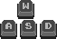
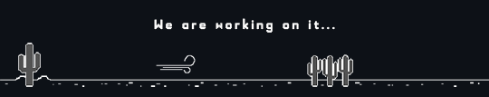

<a id="readme-top"></a>

<div align="center">
  
[![Commits][commits-shield]][commits-url]
[![Issues][issues-shield]][issues-url]

</div>

<br />
<div align="center">
  <a href="https://github.com/lienkko/GhostHouse">
    
  </a>

  <h3 align="center">Ghost House</h3>

  <p align="center">
    2D игра в жанре Roguelike с элементами хоррора
    <br />
  </p>
</div>


<!-- TABLE OF CONTENTS -->
<details>
  <summary>Содержание</summary>
  <ol>
    <li>
      <a href="#о-проекте">О проекте</a>
      <ul>
        <li><a href="#идея">Идея</a></li>
        <li><a href="#цель">Цель</a></li>
        <li><a href="#используемые-ресурсы">Используемые ресурсы</a></li>
      </ul>
    </li>
    <li>
      <a href="#инструкция-по-прохождению">Инструкция по прохождению</a>
      <ul>
        <li><a href="#управление">Управление</a></li>
        <li><a href="#подсказки">Подсказки</a></li>
        <li><a href="#читы">Читы</a></li>
      </ul>
    </li>
    <li><a href="#задачи">Задачи</a></li>
    <li><a href="#участники">Участники</a></li>
    <li><a href="#ps">P.S.</a></li>
  </ol>
</details>


<!-- ABOUT THE PROJECT -->
## О проекте

[![Logo Screen Shot][logo-screenshot]](https://github.com/lienkko/GhostHouse)
### Идея
Главный герой оказывается в отеле, где единственный шанс выбраться, это пройти все двери до 100. По пути ему встречаются разные враждебные существа. Его главные оружия это ум и ловкость, которыми придется пользоваться на протяжении всего прохождения.

### Цель
Наша цель заключается в том, чтобы сделать увлекательную игру с множеством оригинальных головоломок, которая будет пользоваться популярностью среди жюри ПД и остальных студентов мехмата (а может даже за пределами мехмата 😉) .

### Используемые ресурсы

* [![Unity][Unity]][unity-url]
* [![C#][CSharp]][csharp-url]

<!-- GuideMap -->
## Инструкции по прохождению

### Управление

* Ходьба
  <br />
  <a>
    
  </a>
* Бег
  <br />
  <a>
    
  </a>
* Присесть
  <br />
  <a>
    
  </a>
* Использовать/Спрятаться
  <br />
  <a>
    
  </a>
* Подобрать
  <br />
  <a>
    
  </a>
* Выбросить
  <br />
  <a>
    
  </a>
  
### Подсказки
<br />
  <a>
    
  </a>


### Читы

1. God mode
   ```sh
   /command
   ```
2. +100 gold
   ```sh
   /command
   ```

<p align="right">(<a href="#readme-top">К началу</a>)</p>


<!-- ROADMAP -->
## Задачи

- [ ] Реализованы основные механики передвижения
    - [ ] Ходьба
    - [ ] Бег
    - [ ] Приседание
- [ ] Добавлена возможность прятаться
- [ ] Добавлена генерация комнат
- [ ] Реализовано перемещение между комнатами
- [ ] Добавлено стартовое меню
- [ ] Добавлено меню паузы
- [ ] Добавлен инвентарь
- [ ] Добавлены все основные головоломки и испытания
- [ ] Добавлены основные враждебные существа
- [ ] Добавлены боссы и реализована их логика
    - [ ] Босс1
    - [ ] Босс2
    - [ ] Босс3
    - [ ] Босс4
- [ ] Добавлена финальная сцена

<p align="right">(<a href="#readme-top">К началу</a>)</p>


<!-- CONTRIBUTORS -->
## Участники
[![Conributors][contibutors-logo]](https://github.com/lienkko/GhostHouse/graphs/contributors)

<p align="right">(<a href="#readme-top">К началу</a>)</p>

<!-- POST SCRIPTUM -->
## P.S.
Нам очень важно ваше мнение по поводу проекта. Даже если вы жюри, не скупитесь на хороший совет😊. Мы будем рады любой идее и любой конструктивной критике

<p align="right">(<a href="#readme-top">К началу</a>)</p>


<!-- MARKDOWN LINKS & IMAGES -->
[commits-shield]: https://img.shields.io/github/commit-activity/t/lienkko/GhostHouse.svg?style=for-the-badge
[commits-url]: https://github.com/lienkko/GhostHouse/commits
[issues-shield]: https://img.shields.io/github/issues/lienkko/GhostHouse.svg?style=for-the-badge
[issues-url]: https://github.com/lienkko/GhostHouse/issues
[logo-screenshot]: Logo4.png
[Unity]: https://img.shields.io/badge/Unity-000000?style=for-the-badge&logo=unity&logoSize=auto
[unity-url]: https://unity.com
[CSharp]: https://img.shields.io/badge/C%23-000000?style=for-the-badge&logo=dotnet&logoSize=auto
[csharp-url]: https://learn.microsoft.com/ru-ru/dotnet/csharp/
[desert-png]: Desert2.png
[contibutors-logo]: https://contrib.rocks/image?repo=lienkko/GhostHouse 
